# Slide Template

Template of presentation slide by LaTeX.


## デモ / Demo

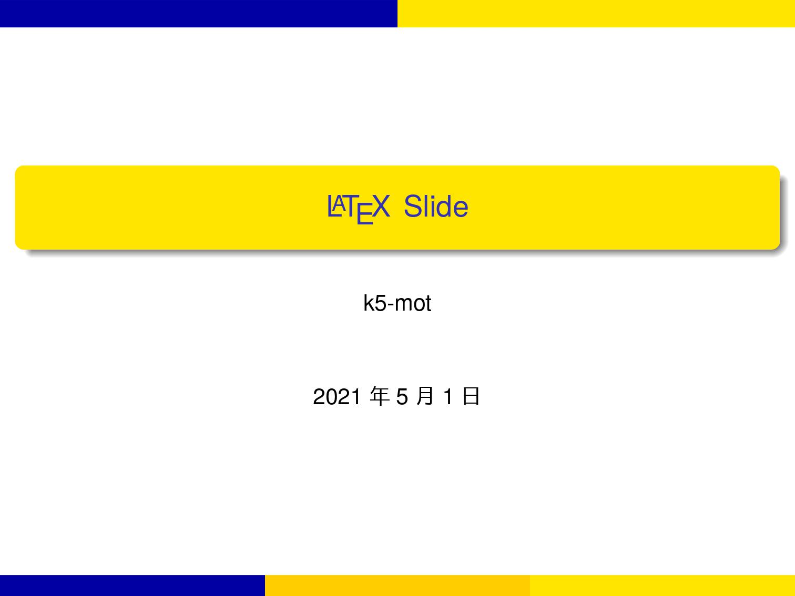 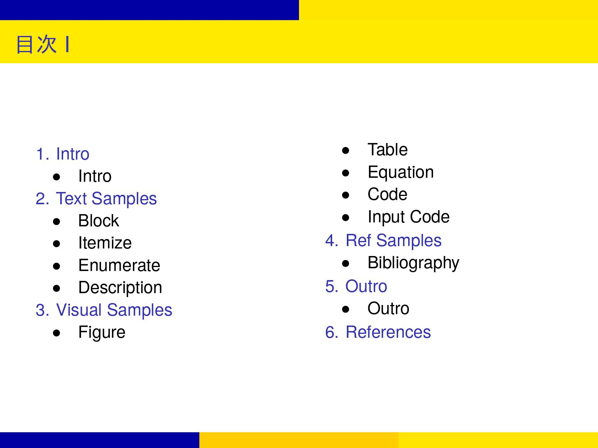
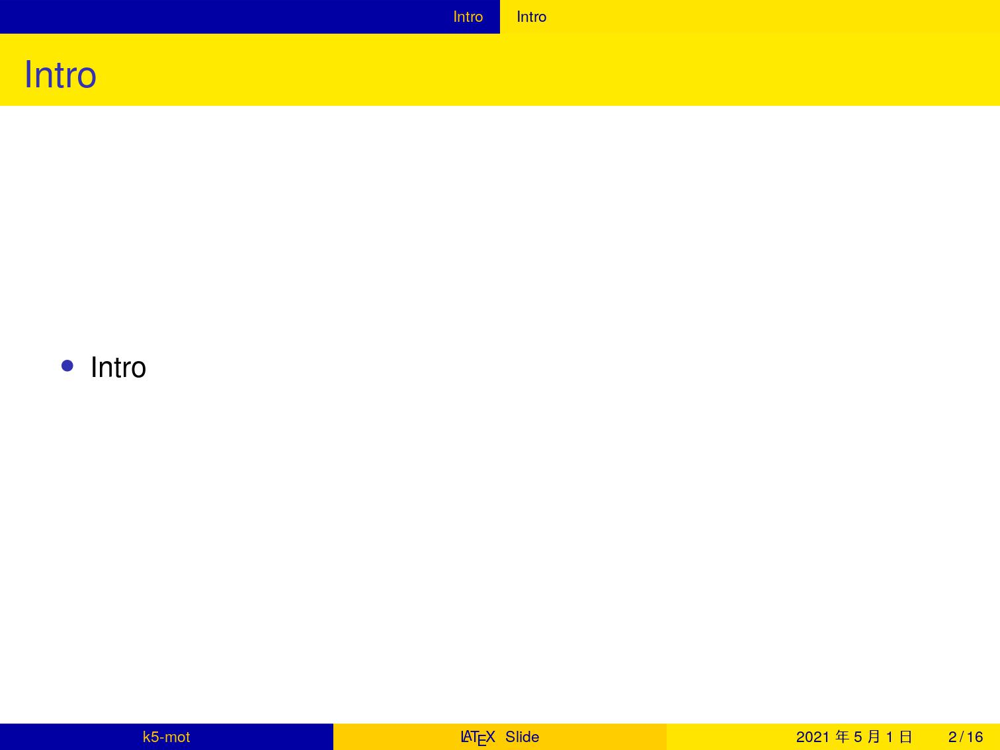 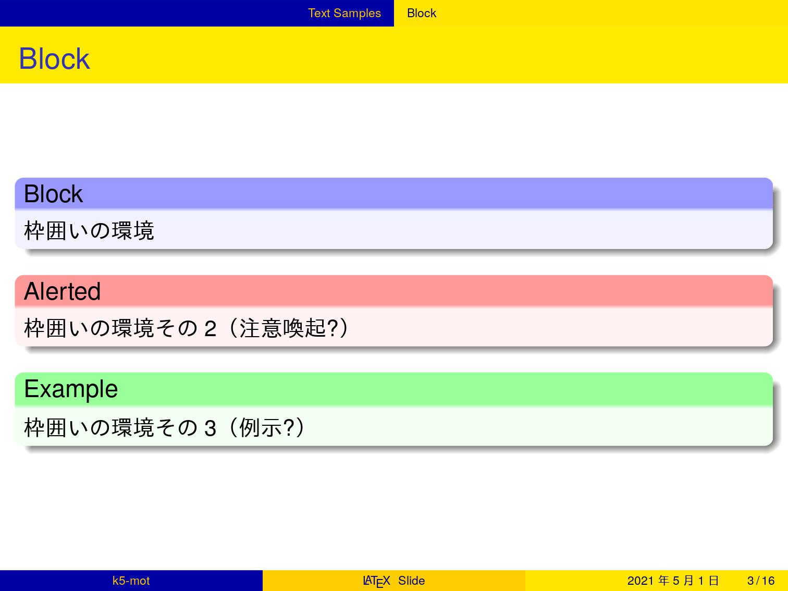
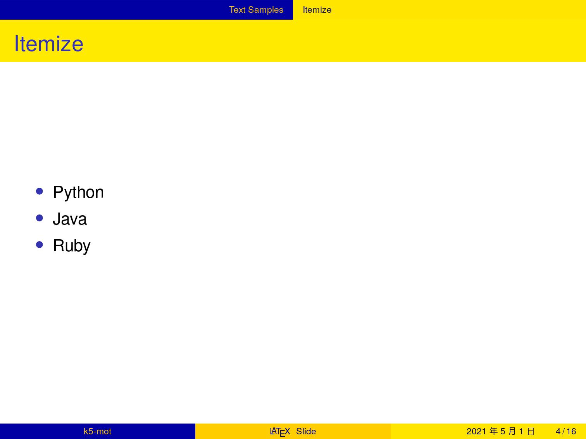 
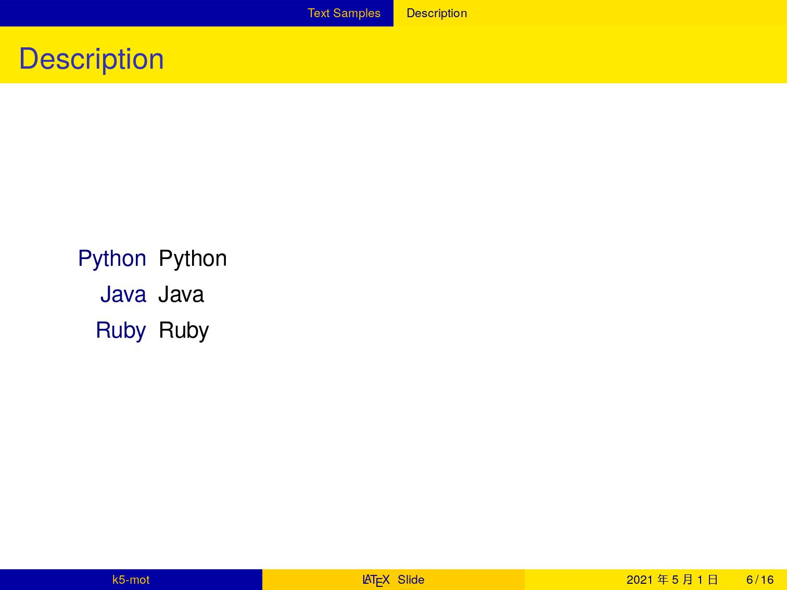 
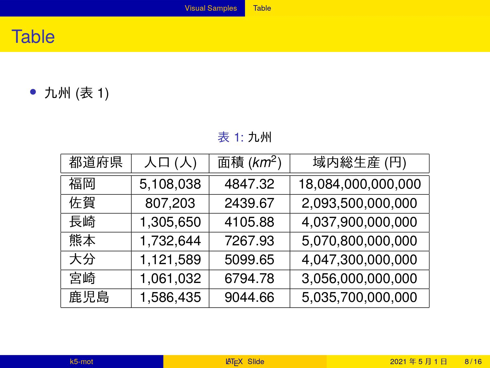 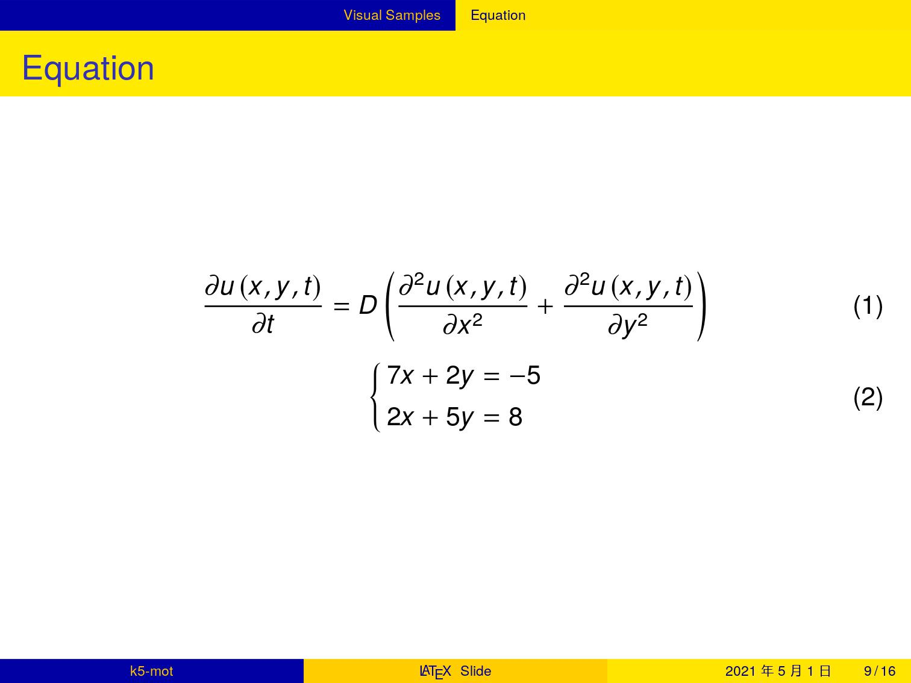
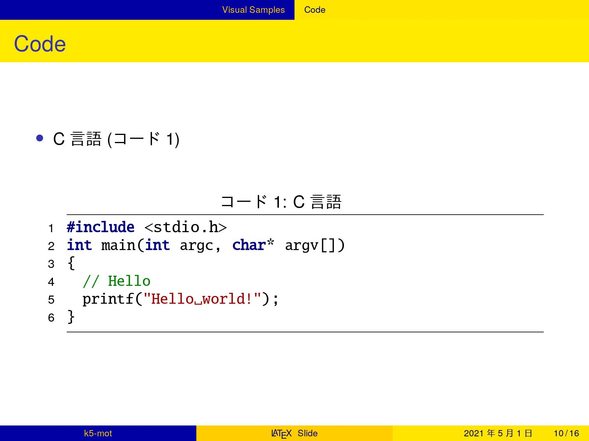 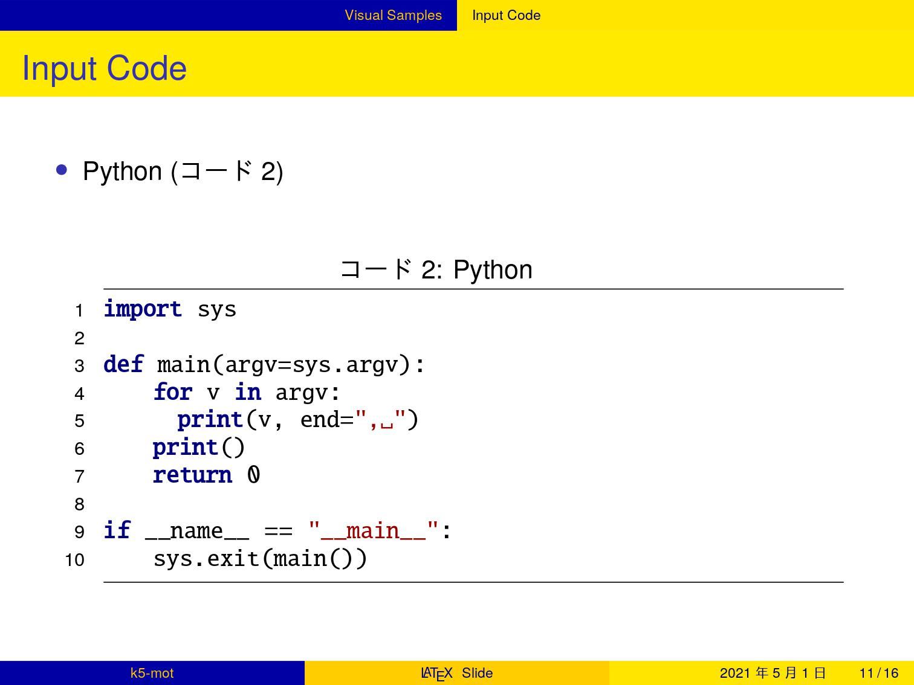
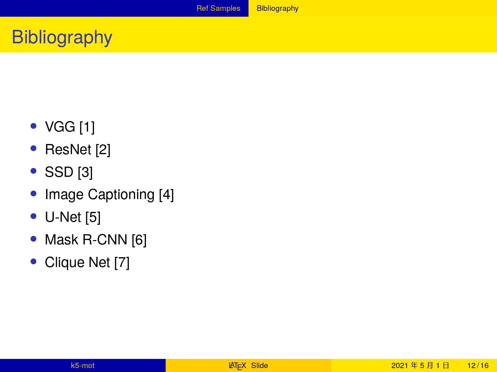 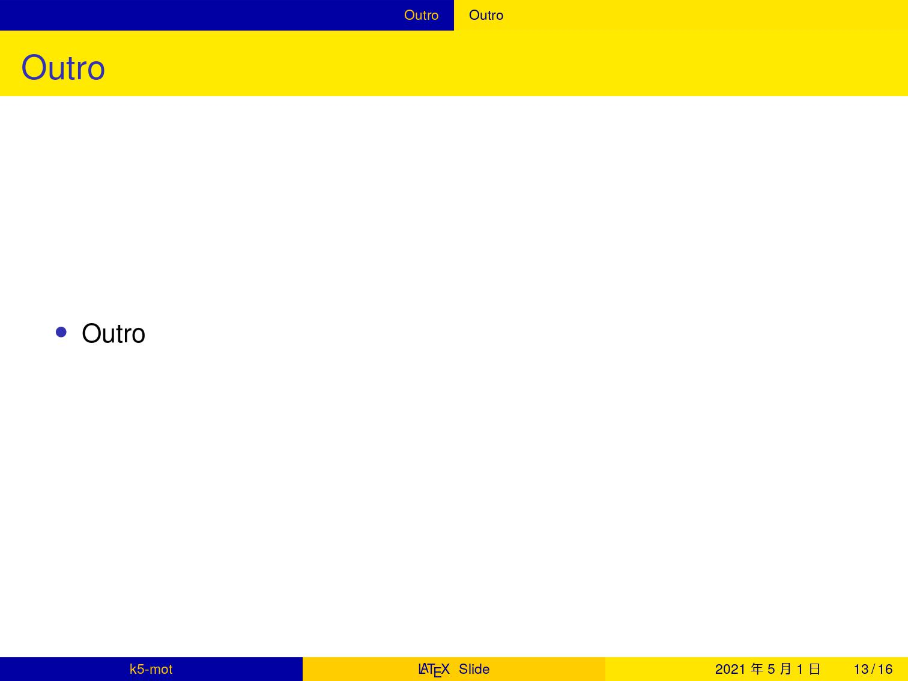
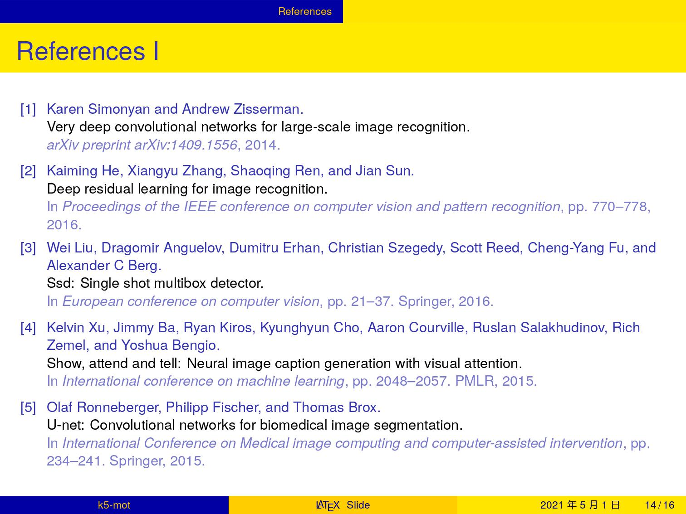 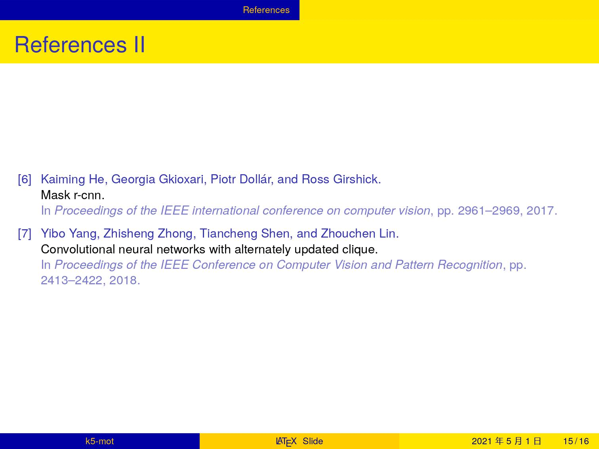


## 🏯 ビルド / Build

### 🍊 Makefile

```bash
# Rebuild all & Remove a part of generated files.
make all
# Build all
make build
# Rebuild all.
make rebuild
# Print debug messages after building.
make debug
# View PDF/PostScript file.
make preview
# Remove a part of generated files.
make clean
# Remove all generated files.
make distclean
# Print help.
make help
```

### 🍌 Latexmk

```bash
# Build all.
latexmk
# Remove all generated files.
latexmk -C
# View PDF file, compiling when the files changed.
latexmk -pvc
```

### 🥝 GitHub Actions

After pushing tag to remote repository,
GitHub Actions compiles this documents,
and releases it to GitHub Releases Page.

```bash
# Add a tag.
git tag -a v0.0.0 -m 'tag comment'
# Share a tag.
git push origin v0.0.0
```


## 🍋 License / ライセンス

Copyright (c) 2021-2022 k5-mot All Rights Reserved.

"k5-mot/slide-template" is under [MIT license](https://en.wikipedia.org/wiki/MIT_License).

